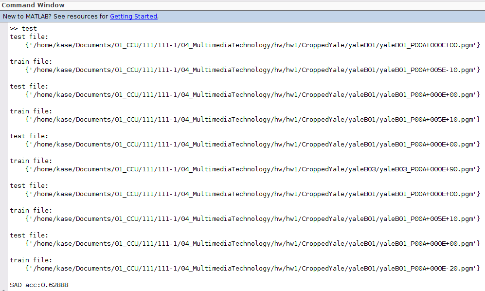

# **Face Recognition using NN search**

408125029 王禮芳

## Program Implementation

程式分成四步驟，分別是讀進檔案、分割資料集、進行NN search以及計算此方法辨識同一人人臉的準確度。

### 1. 讀取檔案

#### 1.1 讀檔案到 image datastore

```matlab
% 1. Read all colar images and converted to gray-scale images
imds = imageDatastore("CroppedYale/", "IncludeSubfolders", true, "LabelSource", "foldernames", "FileExtensions", ".pgm");
fileNum = size(imds.Files, 1);
```
我將圖片資料夾`CroppedYale/`與程式放在同一個目錄底下，透過`imageDatastore()` 將整個圖片資料夾作為一個image datastore imds使用。

這裡只收錄附檔名是 `.pmg` 的圖片。

#### 1.2 將圖片轉成灰階

```matlab
% 1.1 convert rgb photos to gray-scale
for i = 1:fileNum
    [img,info] = readimage(imds, i);
    color = imfinfo(info.Filename);
    if (color.ColorType == "truecolor")
        img = rgb2gray(img);
    end
end
```

使用`readimage()` 順序讀進imds裡面的檔案，並以  `imfinfo()` 取得檔案的資料，如果檔案是rgb色彩，我們就將其轉成灰階。

#### 1.3 刪除大小非 192*168 大小的照片

```matlab
% 1.2 delete photos not in the size of 192*168 from imds
photoSize = 192*168;
for i = 1:fileNum
    tmp = readimage(imds,i);
    tmp = reshape(tmp, 1, []);
    if (length(tmp) ~= photoSize)
        [tmp ,info]= readimage(imds,i);
        delete (info.Filename);
    end
end
imds = imageDatastore("CroppedYale/", "IncludeSubfolders", true, "LabelSource", "foldernames", "FileExtensions", ".pgm");
fileNum = size(imds.Files, 1);
```

發現有些圖片檔案的大小非 192\*168，而這會在進行 NN search時造成問題（比較大小不同的矩陣），這裡會先 `reshape()` 二維圖片使其成為一維，並由此確認這個一維陣列的長度是否為 192\*168，若否，我們就直接將檔案刪除。


### 2. 分割資料集

#### 2.1 分割imds

```matlab
% 2. Randomly split images into trainging set / testing set
[trainSet, testSet] = splitEachLabel(imds, 35, "randomized");
trainNum = numel(trainSet.Files);
testNum = numel(testSet.Files);
```

使用`splitEachLabel()`，以 label 作為分割對象，將原本的 imds 中，每個 label底下以固定比例/數字切成兩個小的image datastore，分別是 `trainSet` 和 `testSet`，同時加上參數 `randomized` 以隨機切分。

#### 2.2 將圖片陣列獨立存出

```matlab
% 2.1 store files in imds trainSet into trainImg
photoSize = 192*168;
trainImg = zeros(trainNum, photoSize);
for i=1:trainNum
     tmp = readimage(trainSet,i);
     tmp = reshape(tmp, 1, []);
     trainImg(i,:) = tmp;
end

% 2.2 store files in imds testSet into testImg
testImg = zeros(testNum, photoSize);
for i=1:testNum
     tmp = readimage(testSet,i);
     tmp = reshape(tmp, 1, []);
     testImg(i,:) = tmp;
end
```

為了進行 NN search ，將圖片轉為一維後存成矩陣 trainImg 以及 testImg，矩陣中每個 row 都是轉成一維的圖片。


### 3. NN search

```matlab
% 3. Find NN for each test image
resIdx = knnsearch(trainImg, testImg,"Distance","cityblock");
% 3.1 show 5 NN result samples
for i=1:5
    disp("test file:");
    disp(testSet.Files(1));
    disp("train file:");
    disp(trainSet.Files(resIdx(i)));
end
```

使用 `knnsearch()` 進行 NN search，`distance` 參數選擇 `cityblock` 表示SAD，同時印出前五組 testing set 與 training set 的配對作為 sample。

回傳的 resIdx 是training set 對應由0開始的 testing set 的配對 index。

*參考資料：https://numerics.mathdotnet.com/Distance.html*


### 4. 計算準確率

```matlab
% 4. Caculate the accuracy for NN method
correctCnt = 0;
for i=1:testNum
    if (trainSet.Labels(resIdx(i)) == testSet.Labels(i))
        correctCnt = correctCnt + 1;
    end
end
acc = correctCnt / testNum;
disp("SAD acc:" + acc);
```

從頭走過一遍 testing set，NN search 找給該 testing image 的 training image是不是來自同一個人（label相同），計算配對正確的組數，最終將其除以 testing set 的總數。

---

## Experiment Result



我從 testing set 中，從頭印出五組NN配對結果的檔案名稱，可以看到除了第三組將B001配對成B003外，其他組都有正確配對

而使用此方法的正確率為 0.62888，計算方法是 `配對正確的組數 / testing set 檔案總數`

---

## Discussion

#### 1. 對此演算法的看法

NN search 帶來了六成多的準確率，事實上比想像中來得低。在這之前我並不知道其他做於人臉辨識的演算法，也認為逐個 pixel 找最小 distance 應該會是有高準確度的方法，但事實似乎並非如此。

除此之外，當切分時從頭開始切，而沒有加上隨機的參數，會使準確度降到4成多，這似乎也顯示如何切分資料也是提昇準確度的關鍵。

#### 2. 面對的問題與解決辦法

##### 2.1 資料如何讀取與儲存

我第一版的 code 不是用 image datastore拿出資料，而是打算開 string array紀錄滿個檔案的全名稱，並以機產生亂數的方式作為切分資料集的 idx ，但這樣做不但使程式碼又臭長，面對錯誤的檔案名稱、讀檔以及把圖片放進矩陣裡都窒礙難行。

後來經過同學開導使用 image datastore，成功寫出本次作業，算是作為一種解決方式。

##### 2.2 如何進行 `knnsearch()`

讀過光方文件後，發現範例都是使用一維資料互相比較、找出最近鄰居，但作業面對是二維的圖片，這使我煩惱許久該如何解決。曾經尋求錯誤的解答方向，不斷上網尋找是否有給高維資料的 NN search 方法，當然也是無功而返。

後來突然有個念頭是或許可以硬把二維圖片轉成一維試試看，這時才發現原來面對多維資料時，大家都是這樣做的。

##### 2.3 .Ambient檔案大小不是 192*168

做 NN search 時也發現，檔案名稱寫了 ambient 的檔案大小似乎都與大家不同，而這使使用 `knnserarch()` 時出現錯誤訊息。

我後來讀檔時再從頭確認一次檔案大小是不是 192*168，不是的話就將其刪除。

（原先使用的舊方法是，如果大小不符，就不要存進圖片陣列裡面，也就是其位置之row 是全為0的。理由是即使有全0的 row 相互誤被配對到，比例在所有 testing set 中依然很小，且刪除似乎也點麻煩，在認為不致影響太多結果的情況下，我選擇置之不理。但後經同學指正，在正式的模型裡應該要把不合乎標準的資料刪除，我才重新真的將它們刪去。）
